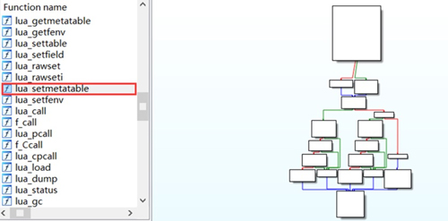
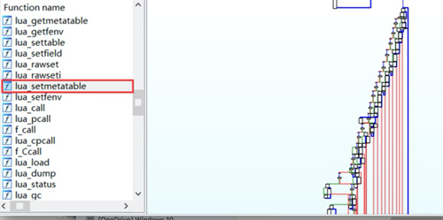
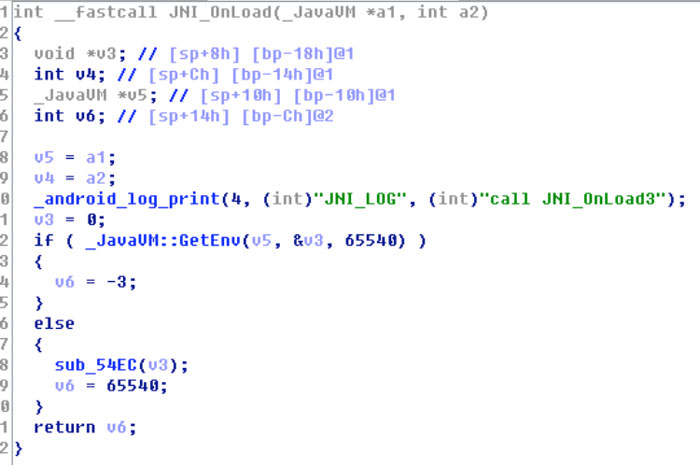
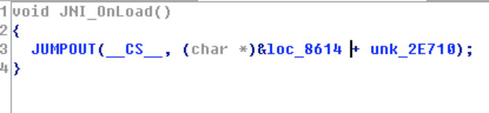
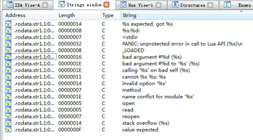
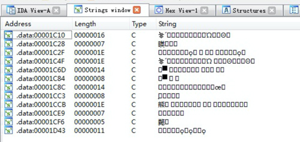

# [KiwiCompiler](https://en.kiwisec.com/product/plat-android.html)  

Source Code Encryption Tool [KiwiCompiler] is a Native source code encryption tool for Internet companies and individual developers. Similar to a normal compiler, it can compile C, C++, Objective-C, Swift and other source code into binary; however, the difference is that the security compiler can perform three security processing on the code when compiling: 1. logical confusion, deformation, expansion. 2.function call relationship encryption. 3. sensitive strings encryption. With the help of those features, the source code security will be greatly improved, preventing the attacker from decompiling the binary code through the reverse tool such as IDA Pro to tamper or steal the core technology.
 
## Features and Advantages
* **Code Obfuscation:** Protect code from expansion, confusion. To prevent reverse analysis by IDA Pro.
* **String Encryption:** Encryption of sensitive strings to prevent attackers from locating core code through keywords.
* **Multi-Language:** Support for obfuscation protection of C, C++, Objective-C, Swift codes.
* **Easy to Use:** Android studio plug-in mode, the same as the original compilation process.

## Functional Description
### 1.Code Obfuscation
Using code warping, code bloat, logic obfuscation at compile stage,can prevent the crack analysis of reverse tools such as IDA Pro

* View the function flow chart of **unencrypted** in IDA Pro

* View the function flow chart of **encrypted** in IDA Pro

### 2.Block Scheduling
Encrypting code references and function calls during the compilation phase can realize function logic hiding and function logic chain breaking, and can prevent static analysis of reverse tools such as IDA Pro.
* Decompile **unencrypted** function in IDA Pro 

* Using Ida Pro to decompile the **encrypted** function will fail because the function call relationship is replaced.

### 3.String Encryption
Encrypting sensitive string data to prevent attackers from using keyword search to locate key codes, increasing reverse difficulty
* View **unencrypted** string in IDA Pro

* View **encrypted** string in IDA Pro    

## Documentation

## Kiwisec
Relying on the technical advantages of the team, KiwiSec focuses on next-generation technology and product development in mobile safety. After 8 years of accumulation in compiler security technology, and 3 years’ continuous research and development, the original KiwiVM virtual machine product has completely solved the problems of weak protection and poor compatibility inherent in traditional technologies such as hardening and obfuscation, providing a convenient and effective security solution.

[Learn more](https://en.kiwisec.com)
